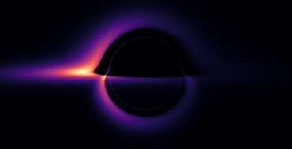

# David Díaz-Guerra

### PhD Researcher | Theoretical Physicist | HPC Developer

I am a PhD Candidate working on **Compact Objects**, from Black Holes to any exotic solution. My research focuses on theoretical models of compact objects and the numerical implementation of **hydrodynamic** and **dynamic system** simulations.

I develop custom GPU-accelerated solvers to study radiation transport and fluid dynamics, as well as deriving analytical field equations using computer algebra systems.

  

---

## Research

My work focuses on solving the dynamic of photons, fluids, or spacetime itself on curved spacetime backgrounds.

* **Ray Tracing & Radiative Transfer:** GPU-accelerated calculation of null geodesics to obtain shadows and study the photon sphere.
* **Relativistic Hydrodynamics:** Hydrodynamic fluids and accretion disks around compact objects and self-gravitating objects.
* **Dynamic Object Simulation:** Collapses and self-gravitating objects.
* **Wave Mechanics:** Evolution of scalar and tensor perturbations around compact objects.

## Current Projects

| Project | Focus | Stack |
| :--- | :--- | :--- |
| **`exac`** | *Fluid Dynamics* | A finite-volume solver for relativistic fluids on spherically symmetric static metrics. `python`, `OpenCL` |
| **`ecos`** | *Ray Tracing* | Ray-tracer tool for photon trajectories. `C`, `python`, `OpenCL` |

### Code Availability

> **Note:** As my core research code is part of my ongoing doctoral thesis, the full implementations are currently **private**. The public repositories are **"lite" versions**. The full source will be open-sourced upon publication of my thesis.

---

### Tech Stack

I utilize a hybrid workflow: **Mathematica (xAct)** for deriving equations and **C/OpenCL/CUDA** for efficient numerical implementations.

**High-Performance Computing (HPC):**

**Symbolic & Analytical:**

**Data Analysis & Scripting:**

### Other Interests

* **Financial Analysis:** In my spare time, I apply my background in numerical modelling to quantitative finance and market analysis.  

## Connect

* [**Inspire-HEP**](https://inspirehep.net/authors/3088465)
* **Email:** ddiazgue[at]ucm.es
